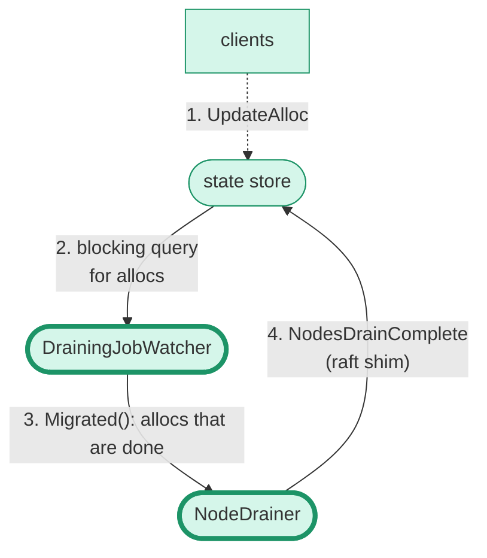
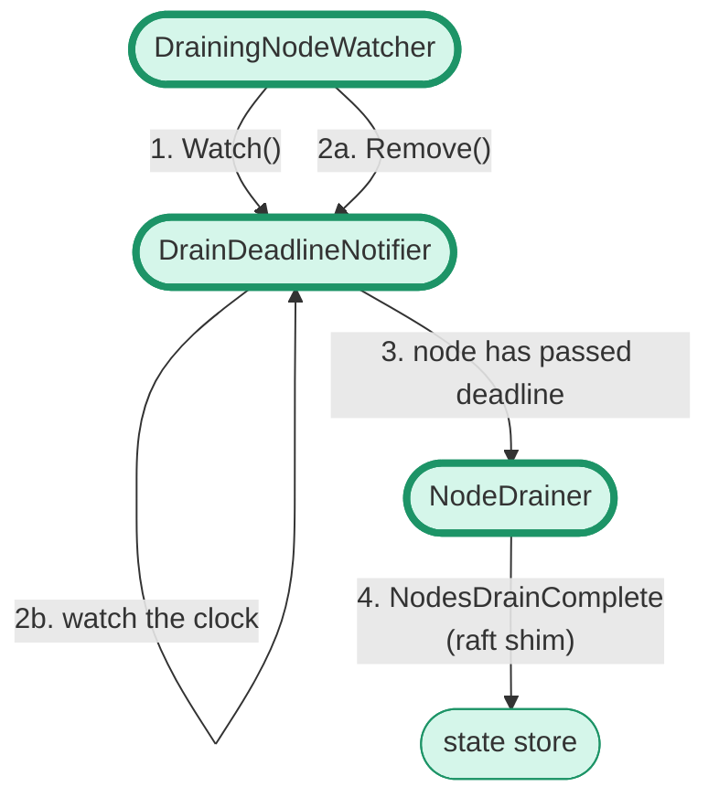

# Architecture: Drainer

The drainer is a component that runs on the leader that services requests from
the [`nomad node drain`][] command and related workflows in the web UI. For a
play-by-play from the user's perspective, see [node drain tutorial][]. This
document describes the internals of the drainer for Nomad developers.

The high-level workflow is that:
* The user sets the drain state of the Client ("Node") in the state store.
* Allocations are migrated according to their `migrate` block.
* The drainer creates a watcher for the Node to fire an event when the work is
  done or the drain's deadline is reached.
* The drainer creates watchers for each job's allocs on the Node, to fire
  progress events.

Effectively the drainer marks allocations for migration and emits an eval, and
then lets the scheduler take it from there.

## Components

There are four major components of the drainer:

- **`NodeDrainer`**: The entrypoint struct for the [`nomad/drainer`][]
  package. This struct runs a top-level event loop that's enabled only on the
  leader. It's configured with the three "watcher" interfaces described below.

- **`DrainingNodeWatcher`**: A watcher interface implemented by the
  `nodeDrainWatcher` struct in [`watch_nodes.go`][]. Runs a loop that watches
  for changes to Nodes. If a Node change transitions a Node to draining, the
  `DrainingNodeWatcher` adds the Node to its tracker. It queries the state store
  to get the jobs that have allocations running on that Node, and registers
  those jobs with the `DrainingJobWatcher`.

- **`DrainingJobWatcher`**: A watcher interface implemented by the
  `drainingJobWatcher` struct in [`watch_jobs.go`][]. Runs a loop that watches
  jobs registered by the `DrainingNodeWatcher` and allocations in the state
  store. The job watcher is where the job's [`migrate`][] block is handled so
  that only the correct number of allocations are being drained at a time. The
  job watcher exposes two methods that return channels:

  - `Drain()` returns a channel that produces a `DrainRequest` for all the
    allocs on these jobs that need to be drained. The `NodeDrainer` turns this
    request into Raft writes via `AllocUpdateDesiredTransition`.

  - `Migrated()` returns a channel that produces slices of allocations that have
    completed migration. "Completed" should mean exactly what the end user would
    expect; the replacement allocations have been placed, `ephemeral_disk` has
    been migrated (if possible), and the old allocation is fully stopped.

- **`DrainDeadlineNotifier`**: A watcher interface implemented by the
  `deadlineHeap` struct in [`drain_heap.go`][]. Runs a loop that tracks the
  Nodes being drained against their deadline timers. The `NodeDrainer` can watch
  the channel returned by the `NextBatch` method to get slices of Nodes that
  have failed to complete their migrations by the deadline.

There is also a collection of other minor components important to understanding
the workflow:

- **Raft shims**: Because the `nomad/drainer` package is not in the same package
  as the server code, the server configures the `NodeDrainer` with shim
  functions that close over the small set of Raft apply functions the drainer
  needs. For this reason they are located in [`nomad/drainer_shims.go`][] rather
  than the `nomad/drainer` package.

  - `AllocUpdateDesiredTransition` includes allocation desired status changes
    and the evaluations that will need to be processed.

  - `NodesDrainComplete` includes updates for the drained Node.

- **`drainingNode`**: This struct represents the state of a single Node whose
  drain is being tracked. Created by the `DrainingNodeWatcher` whenever a
  Node is marked for draining in the state store.

- **`DrainRequest`**: This struct represents a set of allocations that should be
  marked for drain. Created by `DrainingJobWatcher` whenever it receives a job
  to drain.

_A note on code style:_ the drainer is implemented with an unusual amount of
dependency injection via factory functions that return interfaces because it has
to handle state and raft writes without being in the top-level `nomad` package
itself. It also can't import the top-level `nomad` package because the drainer
is instantiated by the server, and that would create a circular
import. Generally speaking we don't want to emulate this style elsewhere in
Nomad because it makes implementation harder to follow, but it makes sense in
this limited case.

## Events

The components combine into three high-level flow of events. The first is the
flow of a newly draining Node. The `NodeWatcher` gets the Node from a blocking
query. It registers the job with the `JobWatcher`. The `JobWatcher` determines
which allocations need draining. These are polled from the `Drain()` channel by
`NodeDrainer` and written to raft via the `AllocUpdateDesiredTransition`
shim. Then the scheduler and clients picks up the changes.

```mermaid
flowchart TD
    %% entities
    clients
    scheduler
    user(user)
    NodeDrainer([NodeDrainer])
    NodeWatcher([DrainingNodeWatcher])
    JobWatcher([DrainingJobWatcher])
    StateStore([state store])

    %% style classes
    classDef component fill:#d5f6ea,stroke-width:4px,stroke:#1d9467
    classDef other fill:#d5f6ea,stroke:#1d9467
    class user,clients,scheduler,StateStore other;
    class NodeDrainer,NodeWatcher,JobWatcher component;

    user -. "1. enable drain\nfor node" .-> StateStore
    StateStore -- "2. blocking query for\nnewly draining nodes" --> NodeWatcher
    NodeWatcher -- "3. RegisterJobs(jobs)" --> JobWatcher
    JobWatcher -- "4. Drain(): allocs for job that need draining" --> NodeDrainer
    NodeDrainer -- "5. AllocUpdateDesiredTransition\n(raft shim)" --> StateStore

    StateStore -. 6. EvalDequeue .-> scheduler
    StateStore -. 7. GetAllocs .-> clients
```

The second is when allocation migrations are complete. The clients update the
state of the migrated allocs. The `JobWatcher` has a blocking query that detects
these changes. Allocs that are done migrating get sent on the `Migrated()`
channel that's polled by the `NodeDrainer`. The `NodeDrainer` determines whether
the Node is done being drained, and writes an update via the
`NodesDrainComplete` raft shim.



And the third is when Nodes pass their deadline. The `NodeWatcher` is
responsible for adding and removing the watch in the `DeadlineNotifier`. The
`DeadlineNotifier` is responsible for watching the timer. If the Node isn't
removed before the deadline, the `DeadlineNotifier` tells the `NodeDrainer` and
the `NodeDrainer` updates the state via the `NodesDrainComplete` shim. At this
point the remaining allocs will be forced to shutdown immediately.



[`nomad node drain`]: https://developer.hashicorp.com/nomad/docs/commands/node/drain
[node drain tutorial]: https://developer.hashicorp.com/nomad/tutorials/manage-clusters/node-drain
[`nomad/drainer`]: https://github.com/hashicorp/nomad/tree/main/nomad/drainer
[`watch_nodes.go`]: https://github.com/hashicorp/nomad/blob/main/nomad/drainer/watch_nodes.go
[`watch_jobs.go`]: https://github.com/hashicorp/nomad/blob/main/nomad/drainer/watch_jobs.go
[`drain_heap.go`]: https://github.com/hashicorp/nomad/blob/main/nomad/drainer/drain_heap.go
[`nomad/drainer_shims.go`]: https://github.com/hashicorp/nomad/blob/main/nomad/drainer_shims.go
[`migrate`]: https://developer.hashicorp.com/nomad/docs/job-specification/migrate
