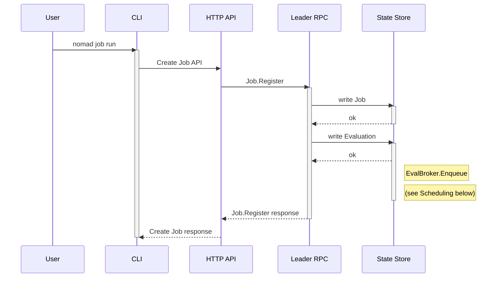
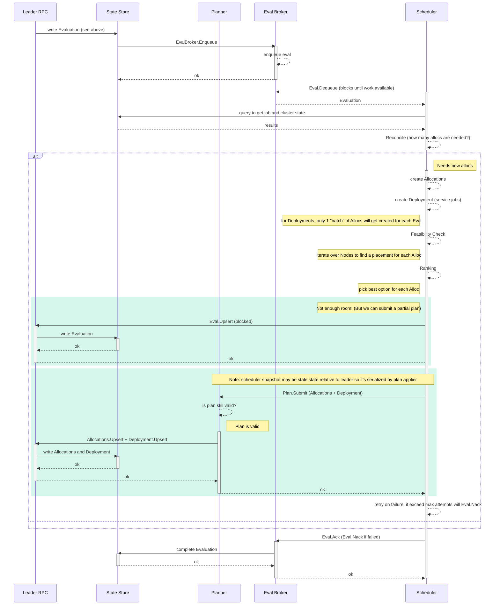
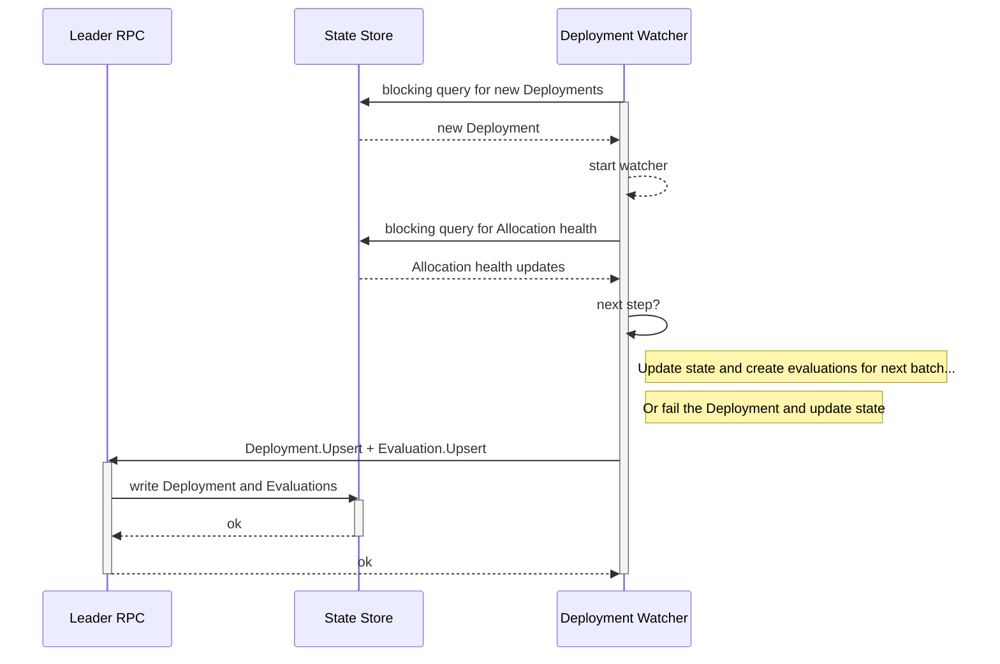
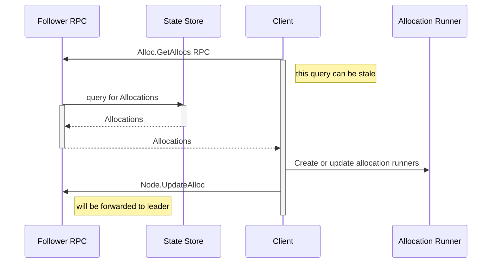

# Architecture: Evaluations into Allocations

The [Scheduling Concepts][] docs provide an overview of how the scheduling
process works. This document is intended to go a bit deeper than those docs and
walk thru the lifecycle of an Evaluation from job registration to running
Allocations on the clients. The process can be broken into 4 parts:

* [Job Registration](#job-registration)
* [Scheduling](#scheduling)
* [Deployment Watcher](#deployment-watcher)
* [Client Allocs](#client-allocs)

Note that in all the diagrams below, writing to the State Store is considered
atomic. This means the Nomad leader has replicated to all the followers, and all
the servers have applied the raft log entry to their local FSM. So long as
`raftApply` returns without an error, we have a guarantee that all servers will
be able to retrieve the entry from their state store at some point in the
future.

## Job Registration

Creating or updating a Job is a _synchronous_ API operation. By the time the
response has returned to the API consumer, the Job and an Evaluation for that Job
have been written to the state store of the server nodes.

* Note: parameterized or periodic batch jobs don't create an Evaluation at
  registration, only once dispatched.
* Note: The scheduler is very fast! This means that once the CLI gets a
  response it can immediately start making queries to get information
  about the next steps.
* Note: This workflow is different for Multi-Region Deployments (found in Nomad
  Enterprise). That will be documented separately.

The diagram below shows this initial synchronous phase. Note here that there's
no scheduling happening yet, so no Allocation (or Deployment) has been created.

## Scheduling

A long-lived goroutine on the Nomad leader called the Eval Broker maintains a
queue of Evaluations previously written to the state store and enqueued via the
`EvalBroker.Enqueue` method. (When a leader transition occurs, the leader
queries all the Evaluations in the state store and enqueues them in its new Eval
Broker.)

Scheduler workers are long-lived goroutines running on all server
nodes. Typically this will be one per core on followers and 1/4 that number on
the leader. The workers poll for Evaluations from the Eval Broker with the
`Eval.Dequeue` RPC. Once a worker has an evaluation, it instantiates a scheduler
for that evaluation (of type `service`, `system`, `sysbatch`, `batch`, or
`core`).

Because a worker is running one scheduler at a time, Nomad's documentation often
refers to "workers" and "schedulers" interchangeably, but the worker is the
long-lived goroutine and the scheduler is the struct that contains the code and
state around processing a single evaluation. The scheduler mutates itself and is
thrown away once the evaluation is processed.

The scheduler takes a snapshot of that server node's state store so that it has
a constant current view of the cluster state. The scheduler executes 3 main
steps:

* Reconcile: compare the cluster state and job specification to determine what
  changes need to be made -- starting or stopping Allocations. The scheduler
  creates new Allocations in this step. But note that _these Allocations are not
  yet persisted to the state store_.
* Feasibility Check: For each Allocation it needs, the scheduler iterates over
  Nodes until it finds up to 2 Nodes that match the Allocation's resource requirements
  and constraints.
  * Note: for system jobs or jobs with with `spread` blocks, the scheduler has
    to check all Nodes.
* Scoring: For each feasible node, the scheduler ranks them and picks the one
  with the highest score.

If the job is a `service` job, the scheduler will also create (or update) a
Deployment. When the scheduler determines the number of Allocations to create,
it examine the job's [`update`][] block. Only the number of Allocations needed
to complete the next phase of the update will be created in a given
allocation. The Deployment is used by the deployment watcher (see below) to
monitor the health of allocations and create new Evaluations to continue the
update.

If the scheduler cannot place all Allocations, it will create a new Evaluation
in the `blocked` state and submit it to the leader. The Eval Broker will
re-enque that Evaluation once cluster state has changed. (This process is the
first green box in the sequence diagram below.)

Once the scheduler has completed processing the Evaluation, if there are
Allocations (and possibly a Deployment) to update, it will submit this work as a
Plan to the leader. The leader needs to validate this plan and serialize it:

* The scheduler took a snapshot of cluster state at the start of its work, so
  that state may have changed in the meantime.
* Schedulers run concurrently across the cluster, so they may generate
  conflicting plans (particularly on heavily-packed clusters).

The leader processes the plan in the plan applier. If the plan is valid, the
plan applier will write the Allocations (and Deployment) update to the state
store. If not, it will reject the plan and the scheduler will try to create a
new plan with a refreshed state. If the scheduler fails to submit a valid plan
too many times it submits a `blocked` Evaluation that is triggered by
`max-plan-attempts` type. (The plan submit process is the second green box in
the sequence diagram below.)

Once the scheduler has a response from the leader, it will tell the Eval Broker
to Ack the Evaluation (if it successfully submitted the plan) or Nack the
Evaluation (if it failed to do so) so that another scheduler can try processing it.

The diagram below shows the scheduling phase, including submitting plans to the
planner. Note that at the end of this phase, Allocations (and Deployment) have
been persisted to the state store.

## Deployment Watcher

As noted under Scheduling above, a Deployment is created for service jobs. A
deployment watcher runs on the leader. Its job is to watch the state of
Allocations being placed for a given job version and to emit new Evaluations so
that more Allocations for that job can be created.

The "deployments watcher" (plural) makes a blocking query for Deployments and
spins up a new "deployment watcher" (singular) for each one. That goroutine will
live until its Deployment is complete or failed.

The deployment watcher makes blocking queries on Allocation health and its own
Deployment (which can be canceled or paused by a user). When there's a change in
any of those states, it compares the current state against the [`update`][]
block and the timers it maintains for `min_healthy_time`, `healthy_deadline`,
and `progress_deadline`. It then updates the Deployment state and creates a new
Evaluation if the current step of the update is complete.

The diagram below shows deployments from a high level. Note that Deployments do
not themselves create Allocations -- they create Evaluations and then the
schedulers process those as they do normally.

## Client Allocs

Once the plan applier has persisted Allocations to the state store (with an
associated Node ID), they become available to get placed on the client. Clients
_pull_ new allocations (and changes to allocations), so a new allocation will be
in the `pending` state until it's been pulled down by a Client and the
allocation has been instantiated.

Once the Allocation is running and healthy, the Client will send a
`Node.UpdateAlloc` RPC back to the server so that info can be persisted in the
state store. This is the allocation health data the Deployment Watcher is
querying for above.

[Scheduling Concepts]: https://developer.hashicorp.com/nomad/docs/concepts/scheduling/scheduling
[`update`]: https://developer.hashicorp.com/nomad/docs/job-specification/update
