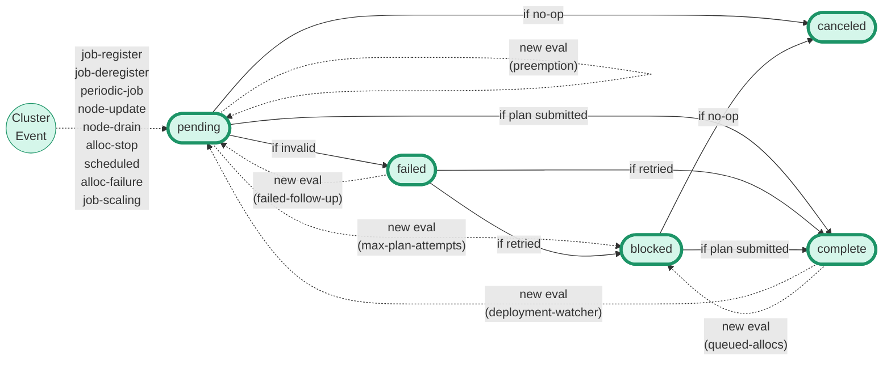
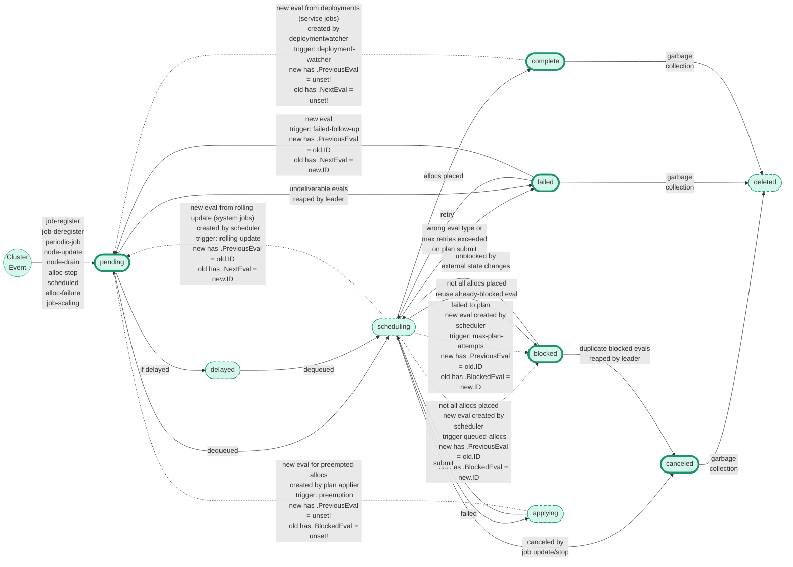

# Architecture: Evaluation Status

The [Scheduling in Nomad][] internals documentation covers the path that an
evaluation takes through the leader, worker, and plan applier. But it doesn't
cover in any detail the various `Evaluation.Status` values, or where the
`PreviousEval`, `NextEval`, or `BlockedEval` ID pointers are set.

The state diagram below describes the transitions between `Status` values as
solid arrows. The dashed arrows represent when a new evaluation is created. The
parenthetical labels on those arrows are the `TriggeredBy` field for the new
evaluation.

The status values are:

* `pending` evaluations either are queued to be scheduled, are still being
  processed in the scheduler, or are being applied by the plan applier and not
  yet acknowledged.
* `failed` evaluations have failed to be applied by the plan applier (or are
  somehow invalid in the scheduler; this is always a bug)
* `blocked` evaluations are created when an eval has failed too many attempts to
  have its plan applied by the leader, or when a plan can only be partially
  applied and there are still more allocations to create.
* `complete` means the plan was applied successfully (at least partially).
* `canceled` means the evaluation was superseded by state changes like a new
  version of the job.

But it's hard to get a full picture of the evaluation lifecycle purely from the
`Status` fields, because evaluations have several "quasi-statuses" which aren't
represented as explicit statuses in the state store:

* `scheduling` is the status where an eval is being processed by the scheduler
  worker.
* `applying` is the status where the resulting plan for the eval is being
  applied in the plan applier on the leader.
* `delayed` is an enqueued eval that will be dequeued some time in the future.
* `deleted` is when an eval is removed from the state store entirely.

By adding these statuses to the diagram (the dashed nodes), you can see where
the same `Status` transition might result in different `PreviousEval`,
`NextEval`, or `BlockedEval` set. You can also see where the "chain" of
evaluations is broken when new evals are created for preemptions or by the
deployment watcher.

[Scheduling in Nomad]: https://developer.hashicorp.com/nomad/docs/internals/scheduling/scheduling
