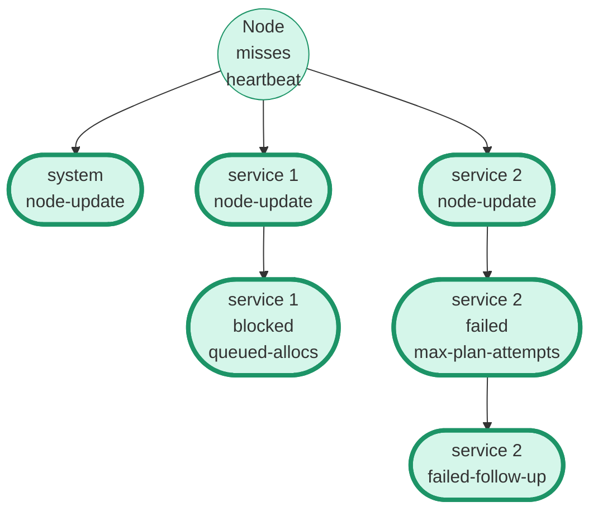
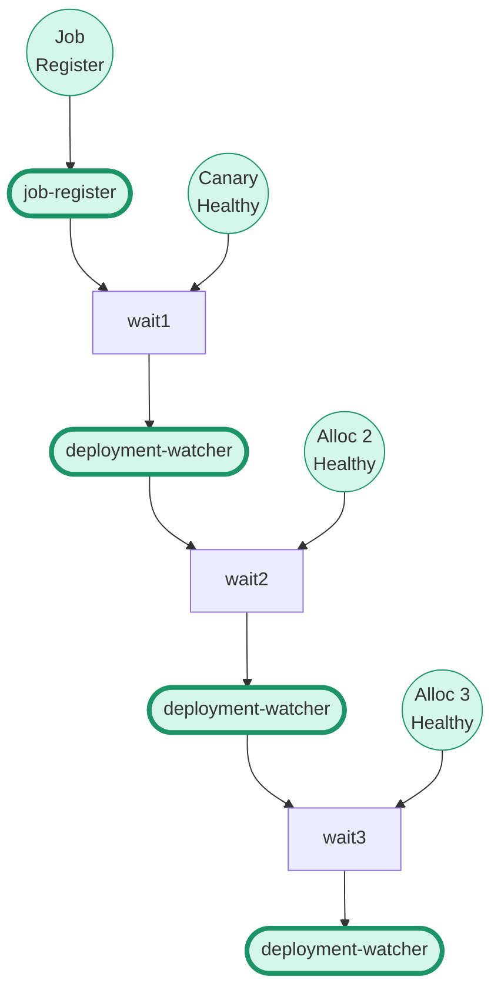

# Architecture: Evaluation Triggers

The [Scheduling in Nomad][] internals documentation covers the path that an
evaluation takes through the leader, worker, and plan applier. This document
describes what events within the cluster cause Evaluations to be created.

Evaluations have a `TriggeredBy` field which is always one of the values defined
in [`structs.go`][]:

```
const (
	EvalTriggerJobRegister          = "job-register"
	EvalTriggerJobDeregister        = "job-deregister"
	EvalTriggerPeriodicJob          = "periodic-job"
	EvalTriggerNodeDrain            = "node-drain"
	EvalTriggerNodeUpdate           = "node-update"
	EvalTriggerAllocStop            = "alloc-stop"
	EvalTriggerScheduled            = "scheduled"
	EvalTriggerRollingUpdate        = "rolling-update"
	EvalTriggerDeploymentWatcher    = "deployment-watcher"
	EvalTriggerFailedFollowUp       = "failed-follow-up"
	EvalTriggerMaxPlans             = "max-plan-attempts"
	EvalTriggerRetryFailedAlloc     = "alloc-failure"
	EvalTriggerQueuedAllocs         = "queued-allocs"
	EvalTriggerPreemption           = "preemption"
	EvalTriggerScaling              = "job-scaling"
	EvalTriggerMaxDisconnectTimeout = "max-disconnect-timeout"
	EvalTriggerReconnect            = "reconnect"
)
```

The list below covers each trigger and what can trigger it.

* **job-register**: Creating or updating a Job will result in 1 Evaluation
  created, plus any follow-up Evaluations associated with scheduling, planning,
  or deployments.
* **job-deregister**: Stopping a Job will result in 1 Evaluation created, plus
  any follow-up Evaluations associated with scheduling, planning, or
  deployments.
* **periodic-job**: A periodic job that hits its timer and dispatches a child
  job will result in 1 Evaluation created, plus any additional Evaluations
  associated with scheduling or planning.
* **node-drain**: Draining a node will create 1 Evaluation for each Job on the
  node that's draining, plus any additional Evaluations associated with
  scheduling or planning.
* **node-update**: When the fingerprint of a client node has changed or the node
  has changed state (from up to down), Nomad creates 1 Evaluation for each Job
  running on the Node, plus 1 Evaluation for each system job that has
  `datacenters` that include the datacenter for that Node.
* **alloc-stop**: When the API that serves the `nomad alloc stop` command is
  hit, Nomad creates 1 Evaluation.
* **scheduled**: Nomad's internal housekeeping will periodically create
  Evaluations for garbage collection.
* **rolling-update**: When a `system` job is updated, the [`update`][] block's
  `stagger` field controls how many Allocations will be scheduled at a time. The
  scheduler will create 1 Evaluation to follow-up for the next set.
* **deployment-watcher**: When a `service` job is updated, the [`update`][]
  block controls how many Allocations will be scheduled at a time. The
  deployment watcher runs on the leader and monitors Allocation healthy. It will
  create 1 Evaluation when the Deployment has reached the next step.
* **failed-follow-up**: Evaluations that hit a delivery limit and will not be
  retried by the eval broker are marked as failed. The leader periodically
  reaps failed Evaluations and creates 1 new Evaluation for these, with a delay.
* **max-plan-attempts**: The scheduler will retry Evaluations that are rejected
  by the plan applier with a new cluster state snapshot. If the scheduler
  exceeds the maximum number of retries, it will create 1 new Evaluation in the
  `blocked` state.
* **alloc-failure**: If an Allocation fails and exceeds its maximum
  [`restart` attempts][], Nomad creates 1 new Evaluation.
* **queued-allocs**: When a scheduler processes an Evaluation, it may not be
  able to place all Allocations. It will create 1 new Evaluation in the
  `blocked` state to be processed later when node updates arrive.
* **preemption**: When Allocations are preempted, the plan applier creates 1
  Evaluation for each Job that has been preempted.
* **job-scaling**: Scaling a Job will result in 1 Evaluation created, plus any
  follow-up Evaluations associated with scheduling, planning, or deployments.
* **max-disconnect-timeout**: When an Allocation is in the `unknown` state for
  longer than the [`max_client_disconnect`][] window, the scheduler will create
  1 Evaluation.
* **reconnect**: When a Node in the `disconnected` state reconnects, Nomad will
  create 1 Evaluation per job with an allocation on the reconnected Node.

## Follow-up Evaluations

Almost any Evaluation processed by the scheduler can result in additional
Evaluations being created, whether because the scheduler needs to follow-up from
failed scheduling or because the resulting plan changes the state of the
cluster. This can result in a large number of Evaluations when the cluster is in
an unstable state with frequent changes.

Consider the following example where a node running 1 system job and 2 service
jobs misses its heartbeat and is marked lost. The Evaluation for the system job
is successfully planned. One of the service jobs no longer meets constraints. The
other service job is successfully scheduled but the resulting plan is rejected
because the scheduler has fallen behind in raft replication. A total of 6
Evaluations are created.



Next, consider this example where a `service` job has been updated. The task
group has `count = 3` and the following `update` block:

```hcl
update {
  max_parallel = 1
  canary       = 1
}
```

After each Evaluation is processed, the Deployment Watcher will be waiting to
receive information on updated Allocation health. Then it will emit a new
Evaluation for the next step. A total of 4 Evaluations are created.



Lastly, consider this example where 2 nodes each running 5 Allocations that are
all for system jobs are "flapping" by missing heartbeats and then
re-registering, or frequently changing fingerprints. This diagram will show the
results from each node going down once and then coming back up.

```mermaid
flowchart TD

    %% style classes
    classDef eval fill:#d5f6ea,stroke-width:4px,stroke:#1d9467
    classDef other fill:#d5f6ea,stroke:#1d9467

    eventAdown((Node A\nmisses\nheartbeat))
    eventAup((Node A\nheartbeats))
    eventBdown((Node B\nmisses\nheartbeat))
    eventBup((Node B\nheartbeats))

    eventAdown --> eventAup
    eventBdown --> eventBup

    A01down([job 1 node A\nnode-update])
    A02down([job 2 node A\nnode-update])
    A03down([job 3 node A\nnode-update])
    A04down([job 4 node A\nnode-update])
    A05down([job 5 node A\nnode-update])

    B01down([job 1 node B\nnode-update])
    B02down([job 2 node B\nnode-update])
    B03down([job 3 node B\nnode-update])
    B04down([job 4 node B\nnode-update])
    B05down([job 5 node B\nnode-update])

    A01up([job 1 node A\nnode-update])
    A02up([job 2 node A\nnode-update])
    A03up([job 3 node A\nnode-update])
    A04up([job 4 node A\nnode-update])
    A05up([job 5 node A\nnode-update])

    B01up([job 1 node B\nnode-update])
    B02up([job 2 node B\nnode-update])
    B03up([job 3 node B\nnode-update])
    B04up([job 4 node B\nnode-update])
    B05up([job 5 node B\nnode-update])

    eventAdown:::other --> A01down:::eval
    eventAdown:::other --> A02down:::eval
    eventAdown:::other --> A03down:::eval
    eventAdown:::other --> A04down:::eval
    eventAdown:::other --> A05down:::eval

    eventAup:::other --> A01up:::eval
    eventAup:::other --> A02up:::eval
    eventAup:::other --> A03up:::eval
    eventAup:::other --> A04up:::eval
    eventAup:::other --> A05up:::eval

    eventBdown:::other --> B01down:::eval
    eventBdown:::other --> B02down:::eval
    eventBdown:::other --> B03down:::eval
    eventBdown:::other --> B04down:::eval
    eventBdown:::other --> B05down:::eval

    eventBup:::other --> B01up:::eval
    eventBup:::other --> B02up:::eval
    eventBup:::other --> B03up:::eval
    eventBup:::other --> B04up:::eval
    eventBup:::other --> B05up:::eval

```



You can extrapolate this example to large clusters: 100 nodes each running 10
system jobs and 40 service jobs that go down once and come back up will result
in 100 * 40 * 2 == 8000 Evaluations created for the service jobs, which will
result in rescheduling of service allocations to new nodes. For the system jobs,
2000 Evaluations will be created and all of these will be no-op Evaluations that
will still need to be replicated to all raft peers, canceled by the scheduler,
and eventually need to be garbage collected.


[Scheduling in Nomad]: https://developer.hashicorp.com/nomad/docs/internals/scheduling/scheduling
[`structs.go`]: https://github.com/hashicorp/nomad/blob/v1.4.0-beta.1/nomad/structs/structs.go#L10857-L10875
[`update`]: https://developer.hashicorp.com/nomad/docs/job-specification/update
[`restart` attempts]: https://developer.hashicorp.com/nomad/docs/job-specification/restart
[`max_client_disconnect`]: https://developer.hashicorp.com/nomad/docs/job-specification/group#max-client-disconnect
