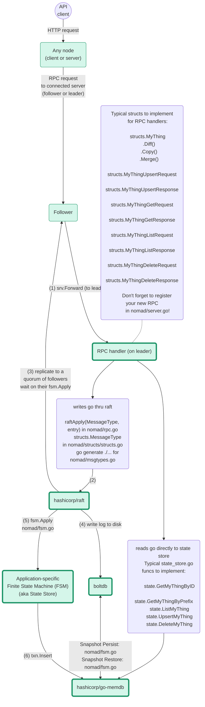

# Architecture: Nomad State Store

Nomad server state is an in-memory state store backed by raft. All writes to
state are serialized into message pack and written as raft logs. The raft logs
are replicated from the leader to the followers. Once each follower has
persisted the log entry and applied the entry to its in-memory state ("FSM"),
the leader considers the write committed. The in-memory state store supports
snapshot isolation, with a copy-on-write data structure to achieve multi-version
concurrency control.

This architecture has a few implications:

* The `fsm.Apply` functions must be deterministic over their inputs for a given
  state. You can never generate random IDs or assign wall-clock timestamps in
  the state store. These values must be provided as parameters from the RPC
  handler.

    ```go
    # Incorrect: generating a timestamp in the state store is not deterministic.
    func (s *StateStore) UpsertObject(...) {
        # ...
        obj.CreateTime = time.Now()
        # ...
    }

    # Correct: non-deterministic values should be passed as inputs:
    func (s *StateStore) UpsertObject(..., timestamp time.Time) {
        # ...
        obj.CreateTime = timestamp
        # ...
    }
    ```

* Every object you read from the state store must be copied before it can be
  mutated, because mutating the object modifies it outside the raft
  workflow. The result can be servers having inconsistent state, transactions
  breaking, or even server panics.

    ```go
    # Incorrect: job is mutated without copying.
    job, err := state.JobByID(ws, namespace, id)
    job.Status = structs.JobStatusRunning

    # Correct: only the job copy is mutated.
    job, err := state.JobByID(ws, namespace, id)
    updateJob := job.Copy()
    updateJob.Status = structs.JobStatusRunning
    ```

* You must be aware of [write skew][] when making writes. Every object you read
  from the state store can change out from under you before you make a
  subsequent write. Any given data field should ideally be written by only one
  component (or even one goroutine) in the cluster. If this can't be achieved,
  you should ensure that one component has the canonical value for that field at
  any given point in time. For example, a scheduler worker can create a
  deployment but the `HealthyAllocs` field of the deployment state can only ever
  be updated via an update from the client, and the client ensures only a single
  such update for a given allocation is in flight at a time.

Adding new objects to the state store should be done as part of adding new RPC
endpoints. See the [RPC Endpoint Checklist][].




[RPC Endpoint Checklist]: https://github.com/hashicorp/nomad/blob/main/contributing/checklist-rpc-endpoint.md
[write skew]: https://jepsen.io/consistency/phenomena/a5b
