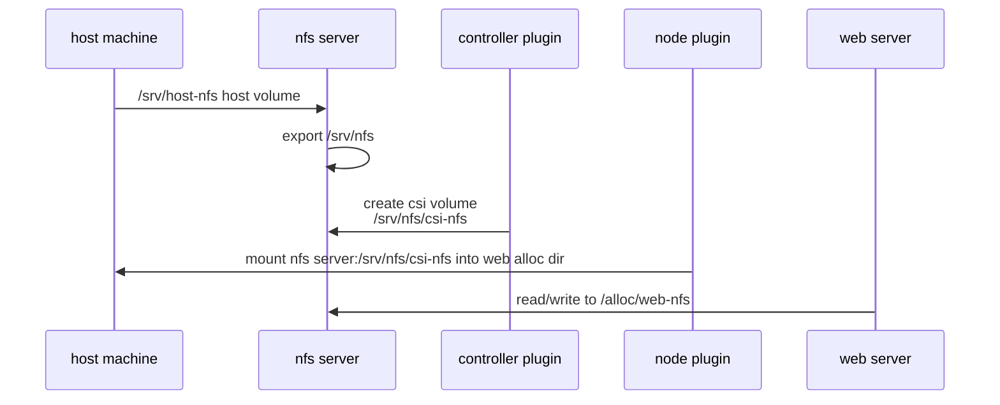

# NFS plugins demo

As easy* as `../hostpath` to run locally, but with separate Controller and 
Node plugins from
[rocketDuck](https://gitlab.com/rocketduck/csi-plugin-nfs).

It is backed by NFS test server container
[atlassian/nfs-server-test](https://hub.docker.com/r/atlassian/nfs-server-test)
for easy setup.

## Overview

This is the general arrangement on a single node.



## Usage

### Setup Nomad

Run on linux, as provided in this repo's root Vagrantfile:

```
vagrant up linux
```

Create a dir on the host that we will serve NFS from:

```
sudo mkdir -p /srv/host-nfs
```

Run a Nomad agent using the `agent.hcl` in this directory:

```
sudo nomad agent -config=agent.hcl
```

You need that agent config to provide the host volume used by NFS,
and to allow docker privileged mode.

### Job setup

The setup script runs all the things for the demo:

```
./setup.sh
```

### Demo web servers

On the host machine (or elsewhere if you have ports open), a couple copies
of a web server show the date stamp of the time of its first launch.

You can get the assigned ports by checking the service:

```
nomad service info web
```

Then curl to see the output, e.g. from the host:

```
$ curl localhost:29291
hello from Wed Apr 12 23:18:01 UTC 2023
```

The web index is stored in NFS, so the same date will be shown on multiple webs
across restarts or reschedules or stops and re-runs. The file persists until
the volume is deleted, either manually or during the following clean-up.

### Clean up

`./teardown.sh` deletes all the things created during Job setup.

It does not delete the Nomad data dir from `/tmp/nomad`,
nor `/srv/host-nfs`.
