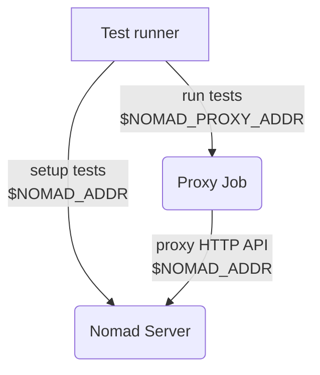

# E2E Tests for Nomad UI

The test infrastructure here is primarily focused on running in our nightly E2E
environment, but you should be able to run these tests against arbitrary
development environments as well.

## Nightly

The nightly test runner executes on our CI provider, but the cluster under test
is running on AWS infrastructure (see [./e2e/terraform][] for details). The
cluster running on AWS is protected by mTLS. Generally speaking operators don't
configure mTLS for the Nomad web UI, and instead configure a [reverse proxy][]
so that's what we've done for nightly as well.

The [./input/proxy.nomad][] job runs a reverse proxy on one of the client nodes,
using the client's own mTLS cert to secure the backend. The front-end uses a
self-signed cert, which is suitable for this testing use case.

Because the test runner talks to both the HTTP API (mTLS) and the web UI (TLS
only), it needs two different addresses. The test runner configuration in
`run.sh` accepts the usual set of [`NOMAD_*` environment variables][] but also a
`NOMAD_PROXY_ADDR` variable that should point to the address and port of the
proxy job running on the cluster.



On nightly, the proxy deployment and `NOMAD_PROXY_ADDR` are set as shown below
(this code lives in a private repo):

```
nomad namespace apply proxy
nomad job run ./e2e/ui/input/proxy.nomad
IP=$(nomad node status -json -verbose $(nomad operator api '/v1/allocations?namespace=proxy' | jq -r '.[] | select(.JobID == "nomad-proxy") | .NodeID') | jq -r '.Attributes."unique.platform.aws.public-ipv4"')
export NOMAD_PROXY_ADDR="https://$IP:6464"
```


## Local Development with Docker or Vagrant

If you're targeting a Nomad agent in your local development environment, you may
not want or need mTLS and everything is a good bit easier. If you don't want to
setup headless browsers for Playwright, you can use the same `./run.sh` script
used in nightly and it'll run the tests inside a container. It will pick up the
[`NOMAD_*` environment variables][] from your shell and set them correctly in
the container.

If you don't deploy the proxy job, you don't need to separately set the
`NOMAD_PROXY_ADDR` address; it will automatically be set to the `NOMAD_ADDR` if
unset.

If you are running the test from Docker (especially Docker for Mac or Docker on
a Vagrant host) against a Nomad agent running directly on your host, make sure
you're setting the `-bind` address for Nomad so that it's visible to the test
runner. Typically you'll need to set `-bind` to your host's IP address
(available from `ifconfig` on macOS or `ip addr` on Linux).


[./e2e/terraform]: https://github.com/hashicorp/nomad/tree/main/e2e/terraform
[reverse proxy]: https://developer.hashicorp.com/nomad/tutorials/manage-clusters/reverse-proxy-ui
[./input/proxy.nomad]: https://github.com/hashicorp/nomad/tree/main/e2e/ui/input/proxy.nomad
[`NOMAD_*` environment variables]: https://developer.hashicorp.com/nomad/docs/commands#command-contexts

## Contributing

This guide contains documentation about contributing to the UI E2E tests using Playwright.

If you're looking for information about using Playwright, please instead refer to the (Playwright documentation)[https://playwright.dev/docs/writing-tests].

### Running the test suite

In order to get the test suite running in an environment similar to what will happen in our CI pipeline, we'll be using the `./run.sh` bash script.

This script, spins up a Docker container that will be used to run our Playwright scripts. The key note to keep in mind here is that, in local development, you'll be spinning up a Nomad server on your local machine and spinning up a container that will run our test scripts which means that you'll need to specify an address for the Nomad agent to bind for network services (in order to get access to the HTTP interface which allows us to use our `./api-client` to set-up and tear down testing arrangements).

Please follow these steps to get up and running:

#### Spin up a Nomad Server

(Optional Step 0): If you're looking to test local UI changes, build the UI by changing directories to get to the root of the Nomad repository and run `make dev-ui`.

1. Spin up a Nomad server that has ACLs enabled AND configures a bind address to `0.0.0.0` which will set the IP address of the default private network.

`nomad agent -dev -config=$YOUR_CONFIG.hcl -bind=0.0.0.0`

2. Bootstrap ACLs

`nomad acl bootstrap`

3. Copy the `Secret ID` of the `stdout` of running the `bootstrap` command.

4. Run `ifconfig` and look at the `stdout` for `en0`. This refers to your physical network interface. Grab the address associated with `inet` which is the address of your host which we'll require as an environment variable in our Playwright scripts to query the Nomad server on your local machine from the Docker container running our Playwright scripts.

#### Running the test suite

Prerequisites:

- Docker Desktop is installed and running on your machine.
- Playwright is (installed)[https://playwright.dev/docs/intro] on your local machine

1. Set your `NOMAD_TOKEN` and `NOMAD_ADDR`. From the previous instructions, set an environment variable `NOMAD_TOKEN` to the value of the `Secret ID` when you bootstrapped ACL tokens (this should be a management token). Also, set a `NOMAD_ADDR` that represents the IP Address of your local machine as mentioned in Step 4 of the previous section.

2. Run `./run.sh` from the root of the `nomad/e2e/ui` directory.

#### Writing your own tests

Writing test code can be a little daunting. I recommend using (Playwright's Test Generator)[https://playwright.dev/docs/codegen-intro] to generate your test code.

1. Run `npx playwright codegen $NOMAD_ADDR/ui`. (Note: a headless Chromium browser and Playwright inspector window will open).
2. In the Chromium (browser) window, click around the test suite as if you're a user.
3. Copy the test code generated in the Playwright inspector video.
4. Run the tests using `npx playwright test $YOUR_TEST_FILE`. You'll likely fail tests when this runs, because Playwright will use generated classnames for HTML elements that are associated with the previous build of the UI using the Ember server. If you have a failure, change your test selectors to be based on text or CSS selectors using the (guides)[https://playwright.dev/docs/selectors].
