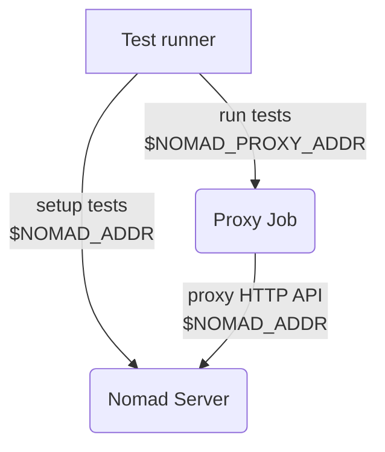

# E2E Tests for Nomad UI

The test infrastructure here is primarily focused on running in our nightly E2E
environment, but you should be able to run these tests against arbitrary
development environments as well.

## Nightly

The nightly test runner executes on our CI provider, but the cluster under test
is running on AWS infrastructure (see [./e2e/terraform][] for details). The
cluster running on AWS is protected by mTLS. Generally speaking operators don't
configure mTLS for the Nomad web UI, and instead configure a [reverse proxy][]
so that's what we've done for nightly as well.

The [./input/proxy.nomad][] job runs a reverse proxy on one of the client nodes,
using the client's own mTLS cert to secure the backend. The front-end uses a
self-signed cert, which is suitable for this testing use case.

Because the test runner talks to both the HTTP API (mTLS) and the web UI (TLS
only), it needs two different addresses. The test runner configuration in
`run.sh` accepts the usual set of [`NOMAD_*` environment variables][] but also a
`NOMAD_PROXY_ADDR` variable that should point to the address and port of the
proxy job running on the cluster.



On nightly, the proxy deployment and `NOMAD_PROXY_ADDR` are set as shown below
(this code lives in a private repo):

```
nomad namespace apply proxy
nomad job run ./e2e/ui/input/proxy.nomad
IP=$(nomad node status -json -verbose $(nomad operator api '/v1/allocations?namespace=proxy' | jq -r '.[] | select(.JobID == "nomad-proxy") | .NodeID') | jq -r '.Attributes."unique.platform.aws.public-ipv4"')
export NOMAD_PROXY_ADDR="https://$IP:6464"
```


## Local Development with Docker or Vagrant

If you're targeting a Nomad agent in your local development environment, you may
not want or need mTLS and everything is a good bit easier. If you don't want to
setup headless browsers for Playwright, you can use the same `./run.sh` script
used in nightly and it'll run the tests inside a container. It will pick up the
[`NOMAD_*` environment variables][] from your shell and set them correctly in
the container.

If you don't deploy the proxy job, you don't need to separately set the
`NOMAD_PROXY_ADDR` address; it will automatically be set to the `NOMAD_ADDR` if
unset.

If you are running the test from Docker (especially Docker for Mac or Docker on
a Vagrant host) against a Nomad agent running directly on your host, make sure
you're setting the `-bind` address for Nomad so that it's visible to the test
runner. Typically you'll need to set `-bind` to your host's IP address
(available from `ifconfig` on macOS or `ip addr` on Linux).


[./e2e/terraform]: https://github.com/hashicorp/nomad/tree/main/e2e/terraform
[reverse proxy]: https://developer.hashicorp.com/nomad/tutorials/manage-clusters/reverse-proxy-ui
[./input/proxy.nomad]: https://github.com/hashicorp/nomad/tree/main/e2e/ui/input/proxy.nomad
[`NOMAD_*` environment variables]: https://developer.hashicorp.com/nomad/docs/commands#command-contexts
