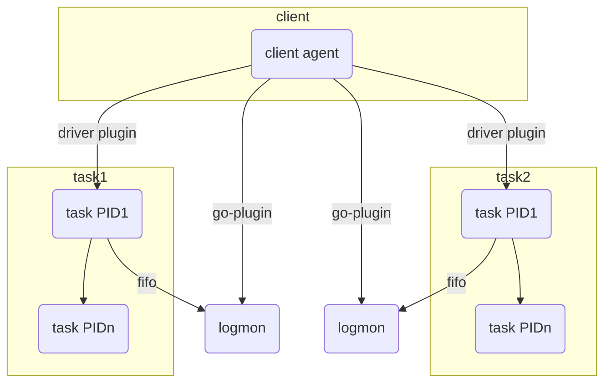
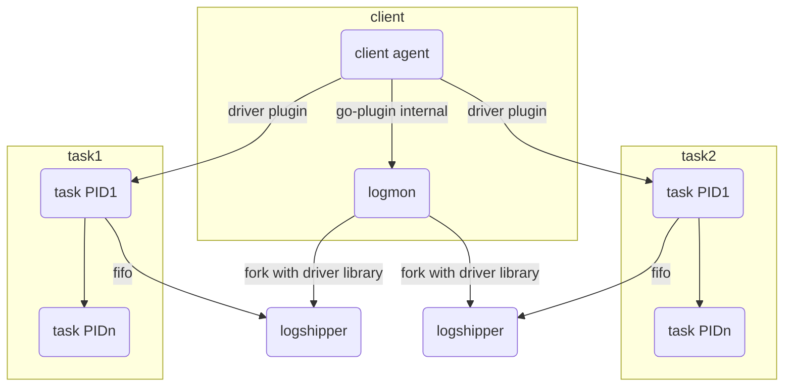
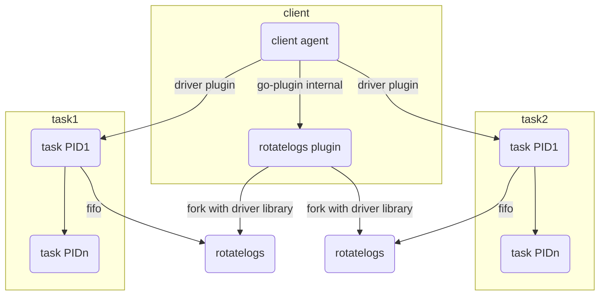
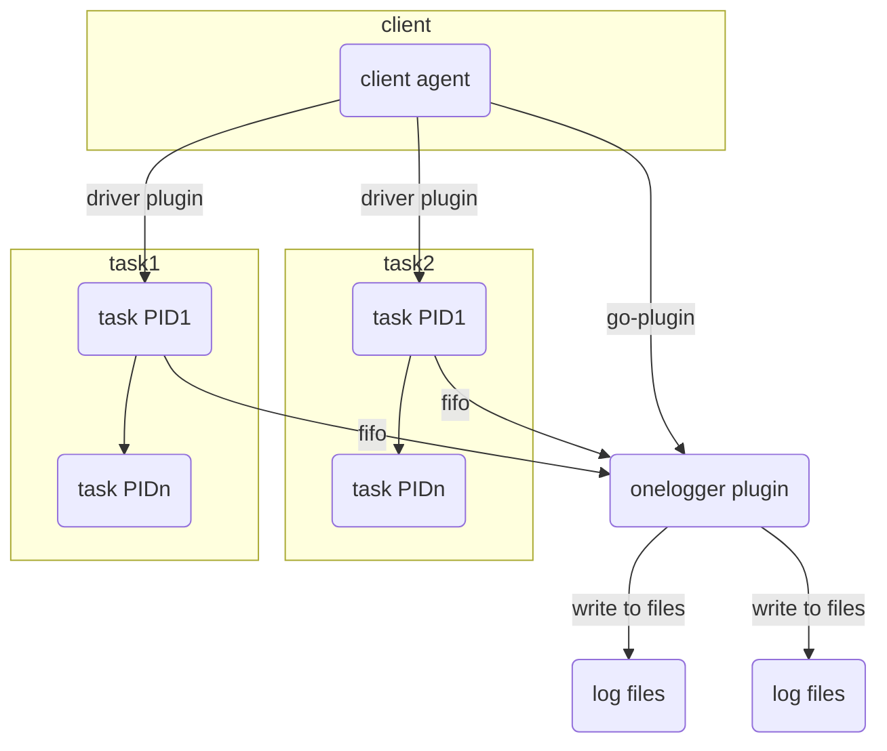
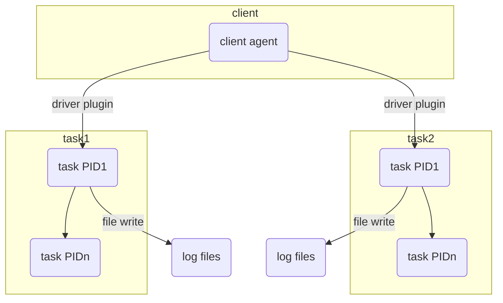
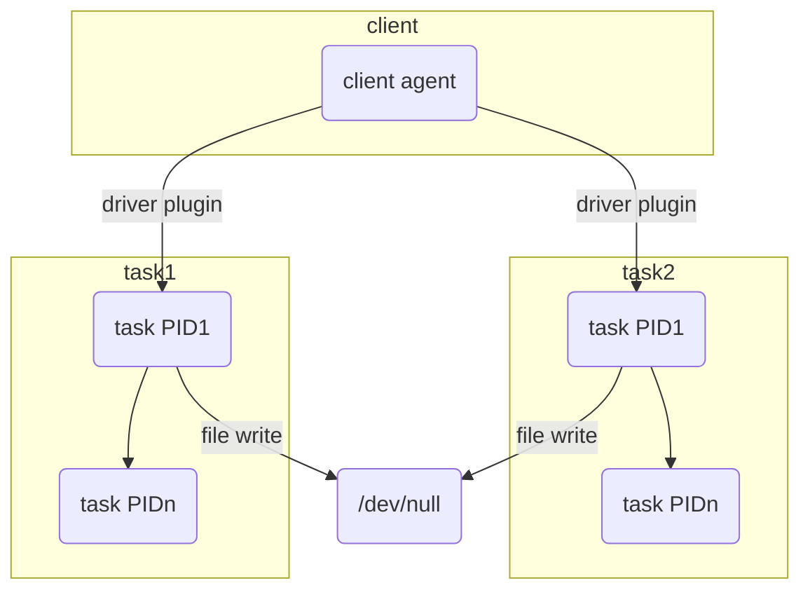

# Logging Plugins

_Note: This branch is currently experimental and not merged to main! It's being used to explore the design space for logging plugins._

The diagrams below describe the relationships between the Nomad client, the proposed logging plugins, tasks, and the resulting logs.

## Legacy Logmon

The existing logmon spawns a separate `logmon` process for each task via
go-plugin.

## New Logmon (Proposed)

Under this approach, logmon is an internal plugin and spawns a separate
`logshipper` process via a task-driver-like fork interface. This will let us
isolate the log shipper tasks.

## rotatelogs

The `rotatelogs` plugin is an example of using the driver library code from the
new `logmon` and using a different `logshipper` process. In this case, using
Apache `rotatelogs` to significantly reduce resource usage for supported
platforms.

## onelogger

The `onelogger` plugin is an example of using the driver library code in an
external log plugin process that doesn't spawn per-task log shipping
processes. This can be useful for environments where noisy neighbors are not
expected to create interference.

## Log Rotation Disabled

By disabling log rotation and removing the log shipping process, tasks can have
their stdout/stderr write directly to files in the allocation log directory
without giving up `nomad alloc logs` functionality. This is especially valuable
for batch tasks, which rarely live long enough for log rotation to be useful and
tend to get used on densely-packed clients.

## Null Logging

For a more extreme version of the above, tasks can be configured to write their
stdout/stderr to `/dev/null`. This assumes that tasks never output any valuable
logs or their logs are being shipped off-host by the task itself.

