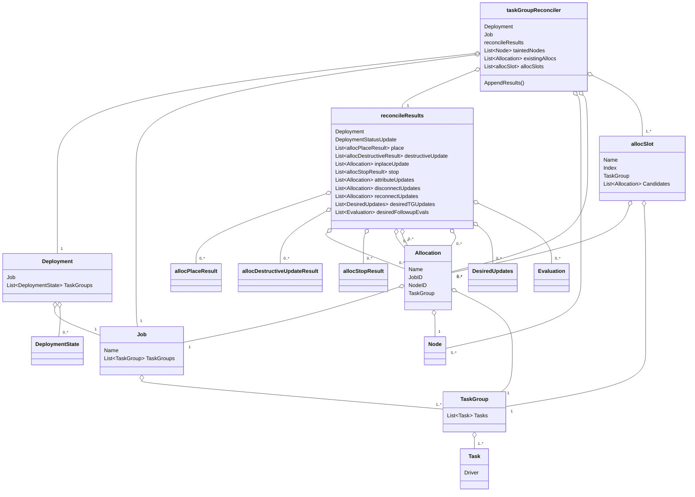
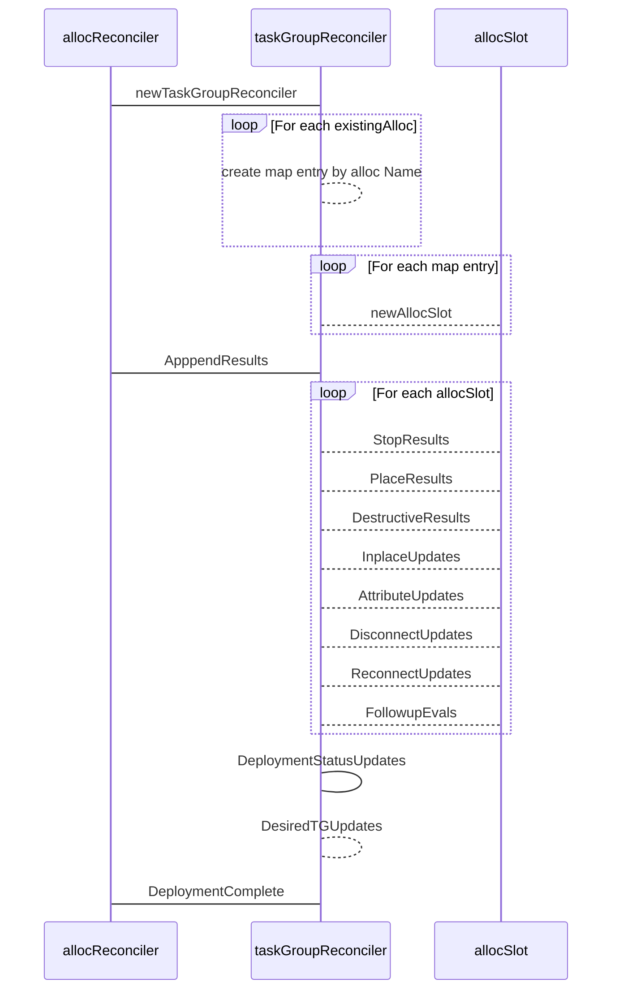

# What?

`TaskGroup` reconciliation is the process by which the scheduler assesses
the current cluster state for a given `TaskGroup`, and computes the changes that
need to be made to reconcile the current state with the desired state.

A partial list of factors that go into this process include:

- Client node status
- Job version
- Allocation desired status, client status, and reschedule policy
- Deployment lifecycle
- Canary configuration and status
- Disconnect configuration

## Why?

The current logic for `TaskGroup` reconciliation has grown organically over time.
The current approach is reminiscent of a stored procedure that tries to manage a number of
in-memory result sets. It starts with a set of `Allocations`, and then progressively groups
and/or filters each set.

This approach to applying domain logic is particularly difficult to maintain or modify when
complex or numerous rules need to be applied because it requires engineers to keep all
the state mutations that have been applied to each set up to the point in the processing chain 
they are currently working on in their working memory.

Some additional complicating factors of the current implementation are:

- The domain logic is sprawled across several files and functions.
- Any given subroutine call may mutate shared state.
- A single concern or domain rule may be implemented across multiple coupled functions.
- The coupling between functions is difficult to identify and easy to forget.
- Testing requires a significant mental lift. The current approach requires 
  engineers to try to imagine all possible cluster states, and then manually
  model them as test cases.
- Testing the function sprawl at the possible test points results in significant 
  near duplication of complex state setup.

Beyond the technical challenges, business concerns support the need to refactor.
Some of these include:

- Multiple engineers on the team have commented that the code is “hard to maintain”, 
  “scary” or that they do not feel confident making changes.
- Having a core piece of the codebase that only a few engineers feel confident
  changing is a "bus-risk".
- Having a core piece of the codebase that engineers do not feel confident changing
  leads to code stagnation, clever hacks, hard to understand behaviors, and ultimately
  devious bugs.
- Beyond the maintenance risks, there may be opportunities to create customer value
  that are not pursued because of the team's aversion to changing this hard to modify
  areas of the code base.
- Complicated legacy code is a barrier for community contributions.

## Requirements

The following requirements are designed to minimize risk, and clearly define success.

- Must be a minimal code change blast radius that requires no changes outside
  the `allocReconciler`.
- Must require minimal changes to the `allocReconciler` itself.
- Must be backwards compatible.
- Must be testable with current tests.
- Must clearly improve readability, maintainability, and our extensibility position.
- Must be backport friendly or slated for a release target that does not require backports.
- Should improve the ability to test with less complex setup.

## How?

Currently, the `allocReconciler.computeGroup` function is a procedural function call
chain. It creates several `allocSet` instances and passes them to subroutines that 
manipulate them. Many of those subroutines rely on processing logic that was applied
in another previously executed subroutine. Some of them perform work not implied
by their name.

### Proposed Solution

Rather than adopting a paradigm based on set theory and procedural programming, the
`taskGroupReconciler` reconciles a `TaskGroup` using a domain model approach. The
idea is to break the problem into a set of smaller problems that are limited in scope
and complexity.

The proposal introduces two new domain components to handle allocation reconciliation:

- `taskGroupReconciler`
- `allocSlot`

The design of these two components center around simplifying reconciliation by changing
the mental model for reconciling allocations from _sets_ to _slots_.

#### taskGroupReconciler

The `taskGroupReconciler` acts as the primary aggregate root. That means its job is to
manage the relationships between components and provide or execute domain logic. It accepts
incoming cluster state and desired the `TaskGroup` configuration. From the configuration and
the state, it appends values to the `allocRunner.reconcileResults` instance which is
used by the `GenericScheduler` to create a `Plan`. Processing takes place in three
phases. The phases are as follows:

- Instantiation:
  - Creates a `map[string][]*structs.Allocation` where the map key is the `Allocation.Name`
    and the value is a slice of `Allocation` instances that share that name.
  - Creates a slice of `allocSlot` instances with a `len` equal to the `TaskGroup.Count`
    configuration value.
  - As each `allocSlot` is created, existing `Allocation` instances are added to its `Candidates`
    slice based on `Allocation.Name`.
  - `Allocation` instances that don't match an `allocSlot.Name` can immediately be discarded or
    added to the `reconcileResults.stop` slice since they do not target a currently valid slot.
    This scenario indicates a reduction in the configured `TaskGroup.Count`.
- `AppendResults`:
  - Iterates over each `allocSlot` and calls a set of domain methods on each instance that are
    purpose built to return appendable results for each field that `reconcileResults` requires.
  - This simplifies debugging and testing because the set of `Allocation` instances being analyzed
    at any point in time is limited to a finite subset.
- `DeploymentComplete`:
  - Performs the same logic as the current `isDeploymentComplete` function, but using internal
   `taskGroupReconciler` fields or methods.

#### `allocSlot`

Given that a `TaskGroup` has a `Count` field, we can mentally model `Count` as
a number of slots that need to be filled. The `existingAllocs` that are passed
during instantiation are `Allocation` instances that map to these slots by `Name`.
The `Allocation.Name` field is a rich text field that includes the `Job.ID`, 
`TaskGroup.Name`, and an index value(e.g `exmaple.web[0]`). The index values 
are constrained from 0 to `TaskGroup.Count` - 1. This specially formatted `Name`
is the unique identifier for each slot.

To manage this relationship between `existingAllocs` and the `Job` specification, we
create an `allocSlot`. An `allocSlot` is a subordinate of the `taskGroupReconciler`, but
acts as a separate aggregate root for`Allocation` instances that share the same _`Name`_.
Its job is to apply the domain logic for reconciliation for a given slot against
all the possible allocations that target that slot. The map of potential `Allocations`
are called the `Candidates`. Constraining the number of allocations being handled at
any given point in time to those that are all candidates for the same slot simplifies
both development and debugging.

#### Domain Model

The following diagram illustrates the domain model in terms of the
relationships between the different components.

**Note that only the `TaskGroupReconciler` and `allocSlot` are new components.
Except for the `allocReconciler`, the rest of the components in the diagram are
existing domain entities or data objects.**

#### Workflow

Changes to the `allocReconciler` are limited. The `computeDeploymentComplete` function
is changed to call `reconcileGroup` instead of `computeGroup`. The new `reconcileGroup`
function is appended to the end of the file. The `taskGroupReconciler` and `allocSlot`
types are defined in new code files. **This limits the impact on merge conflicts, 
and facilitates backport, if required.**

The `reconcileGroup` function is responsible for instantiating a new `taskGroupReconciler`
instance. It passes the all required state as well as the `allocRunner.results` instance
during instantiation. It then calls `taskGroupReconciler.AppendResults()` which
updates the `allocRunner.result` instance. Finally, it returns the result of
`DeploymentComplete` to the `computeDeploymentComplete` outer loop. This breaks
the processing into three distinct phases: Instantiation, `AppendResults`, and
`DeployComplete`. Each is discussed in further detail below. The following sequence diagram
illustrates the high level flow.

### Backwards compatibility

The following sections go into more detail about how the proposed solutions meets
the requirements.

Provides backward compatibility by:

- Hooking into the `GenericScheduler` using the existing `reconcileResults` interface to
  obviate the need for upstream changes.
- Hot swappable with current unit tests.
- Uses new code files. It is backport friendly as well, because changes to existing
  code files is limited to changing one line in one method, and adding 1 new 4 line function.

### Readability

Improves readability by:

  - Encapsulating business rules with domain methods
  - Describing the end state in terms of domain methods
  - Initialization of state fields
  - Expressing state filters as domain methods and/or state field comparisons

### Maintainability

Improves maintainability by:
  - Minimizing and localizing state mutations.
  - Moving to a domain model instead of set filtering.
  - Reducing the number of multiphase calculations (e.g. filterByTainted, filterByReschedulable, computeStop)
  - Reduced ines of code per function helps with back ports and merge conflicts.

### Extensibility

Improves extensibility by:

  - Exposing explicit extension mechanisms.
  - Providing a TDD friendly interface.

