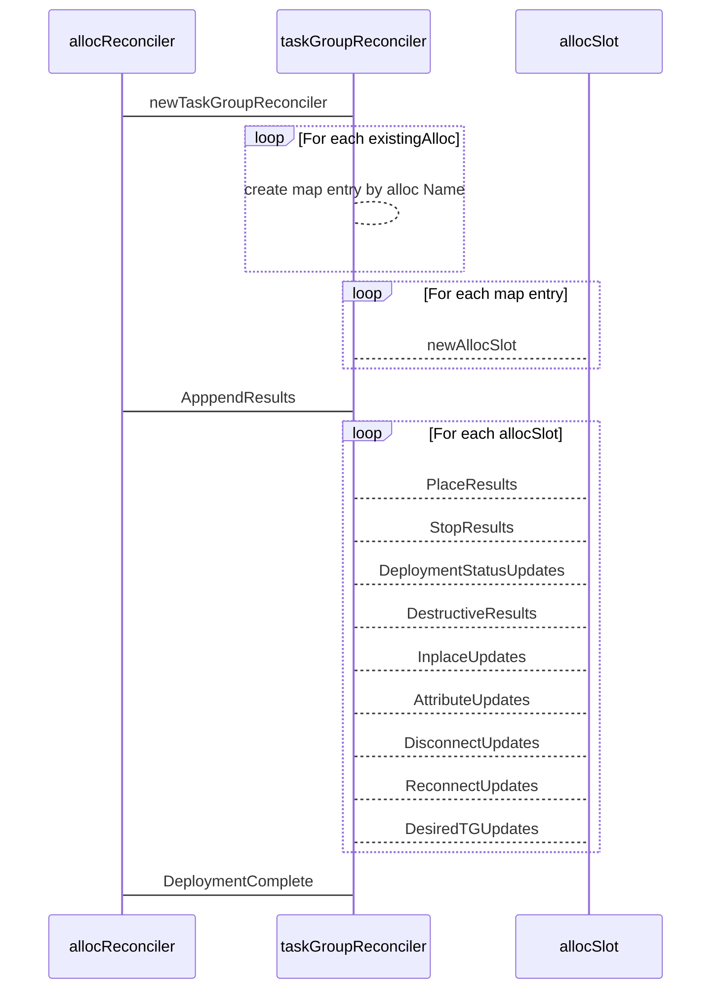

# Why?

The current logic for Task Group reconciliation has grown organically over time. Logic is 
sprawled across several files & functions, state is mutated in multiple places, and testing 
requires a significant mental lift. Adding new features or alternate behaviors is difficult
in that it requires changes in numerous coupled functions. The relationship between coupled
functions is not immediately apparent.

The current approach is reminiscent of a stored procedure that tries tommanage a number of
in-memory result sets. Specifically, it starts with a set of entities of  interest, in this
case `Allocations`, and then progressively groups and/or filters the set. This approach to 
applying business rules is particularly challenging because it introduces the cognitive 
overhead of understanding the state mutations that have already been applied to each set prior
at any given point in the processing chain. 

While SQL is limited to set manipulation, `go` is a full-featured language that is not limited
to a single paradigm. Since a `TaskGroup` is a struct that contains other structs, It should be
possible to devise a domain model that provides the correct results in a more readable, maintainable,
extensible, and testable way.

Beyond the academic analysis, practical business reasons support the need to refactor. Multiple
engineers on the team have commented that the code is “hard to maintain”, “scary” or that they do
not feel confident making changes. Having a core piece of the codebase that engineers do not feel
confident changing leads to code stagnation and devious bugs. Beyond the maintenance cost, there
may be opportunities to create customer value that are not pursued because of the team's aversion
to changing this, and other hard to maintain areas of the code base.

## Requirements

- Needs to be completely backwards compatible.
- Must be hot swappable with current unit tests and not fail.
- Must clearly improve readability
- Must clearly improve maintainability.
- Must clearly improve our extensibility position.
- Should be backport friendly or slated for a release target includes major changes.

## How

The `TaskGroupReconciler` (working name) is designed to be usable as a drop-in replacement of the current
`allocReconciler.computeGroup` method. Its purpose is to assess the current cluster state for a given
`TaskGroup` versus the desired state, and compute the changes that need to be made to reconcile the current
cluster with the desired state.

A partial list of factors that go into this process include:

- Client node status
- Job version
- Allocation desired status, client status, and reschedule policy
- Deployment status
- Canary status
- Disconnect configuration

### Proposed Solution

Rather than adopting a paradigm based on set theory, the `TaskGroupReconciler` reconciles a
`TaskGroup` using the domain model approach. The idea is to break the problem into a set of
components that process a focused area of the problem. The following diagram illustrates the
relationships between the different components.

#### allocReconciler

Changes to the `allocReconciler` are limited. The `computeDeploymentComplete` function
is changed to call `reconcileGroup` instead of `computeGroup`. The new `reconcileGroup`
function is appended to the file. This function is responsible for instantiating a new
`TaskGroupReconciler` instance. It passes the `allocRunner.reconcileResults` instance
to the `TaskGroupReconciler.AppendResults` function, and returns the result of
`DeploymentComplete` to the `computeDeploymentComplete` outer loop.

#### taskGroupReconciler

The `taskGroupReconciler` acts as the primary aggregate root. That means its job is to 
manage the relationships between structs and provide or execute domain logic. It accepts
incoming cluster state and desired `TaskGroup` configuration. From the configuration and
the state, it can append values to the `allocRunner.reconcileResults` instance which is
then used by the `GenericScheduler` to create a `Plan`. Processing takes place in three
phases. The workflow is as follows.

- Initialization:
  - Creates a `map[stromg]*structs.Allocation` where the map key is the `Allocation.Name`.
  - Creates a slice of `allocSlot` instances with a `len` equal to the `TaskGroup.Count`
  - configuration value.
  - As each `allocSlot` is created, existing `Allocation` instances are added to it's `Candidates`
  - slice based on `Allocation.Name`.
  - `Allocation` instances that don't match an `allocSlot.Name` can immediately be discarded or
    added to the `reconcileResults.stop` slice since they do not target a currently valid slot.
  - 
- `AppendResults`:
  - Iterates over each `allocSlot` and calls a domain method
    on each instance that is purpose built to return appendable results for each slice field
    that `reconcileResults` requires.
  - This simplifies debugging, because now the set of `Allocation` instances being analyzed is
    limited to what should be a very finite subset.
- `DeploymentComplete`:
  - Peforms essentially the same logic as the current `isDeploymentComplete` function

#### allocSlot

Given that a `TaskGroup` has a `Count` field, we can mentally model `Count` as a number of slots that
need to be filled. The `existingAllocs` that are passed during instantiation are part of the cluster
are existing `Allocation` instances that map to these slots, and they map by name. We are also passed
a `Job` which contains the desired configuration for all its `TaskGroup` members.

`Allocation` instances for a `TaskGroup` have a `Name` field, which is rich text field that includes
the `Job.Name`, `TaskGroup.Name`, and an index value (e.g `exmaple.web[0]`). The index values are 
constrained from 0 to `TaskGroup.Count` - 1.

To manage this relationship between `existingAllocs` and the `Job` specification, we use an `allocSet`.
An `allocSlot` is a subordinate of the `taskGroupReconciler`, but acts as a separate aggregate root for
`Allocation` instances that share the same _`Name`_.

#### reconcileResults

The following sections go into more detail about how the proposed solutions meets
the requirements.

### Backwards compatibility

Provides backward compatibility by:

- Hooking into the `GenericScheduler` using the existing `reconcileResults` interface to
  obviate the need for upstream changes.
- Hot swappable with current unit tests.
- Uses new code files. It is backport friendly as well, because changes to existing
  code files is limited to changing one line in one method, and adding 1 new 4 line function.

### Readability

Improves readability by:

  - Encapsulating business rules with domain methods
  - Describing the end state in terms of domain methods
  - Initialization of state fields
  - Expressing state filters as domain methods and/or state field comparisons

### Maintainability

Improves maintainability by:
  - Minimizing and localizing state mutations.
  - Moving to a domain model instead of set filtering.
  - Reducing the number of multiphase calculations (e.g. filterByTainted, filterByReschedulable, computeStop)
  - Reduced ines of code per function helps with back ports and merge conflicts.

### Extensibility

Improves extensibility by:

  - Exposing explicit extension mechanisms.
  - Providing a TDD friendly interface.

