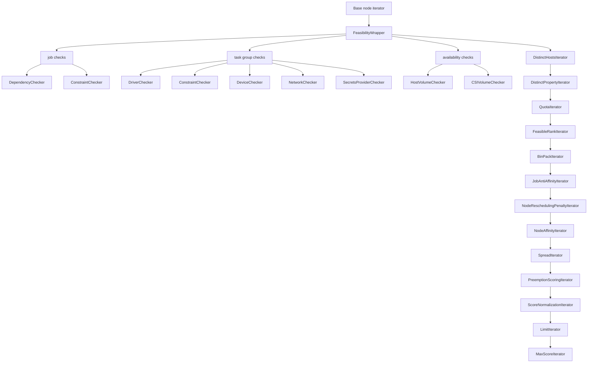
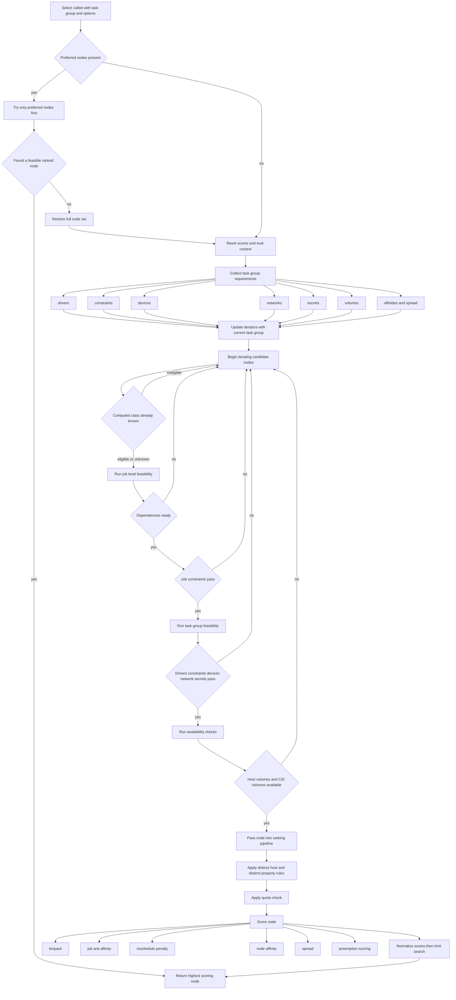

# Feasible Package Flow

This package is easiest to understand in two phases:

- stack construction: build a chain of iterators and checkers
- selection: push one task group through that chain until one node wins

## 1. Generic stack construction

This is the main idea in [scheduler/feasible/stack.go](/Users/juanita.delacuestamorales/go/src/github.com/hashicorp/nomad/scheduler/feasible/stack.go):

- everything before `FeasibleRankIterator` is still filtering nodes out
- everything after `FeasibleRankIterator` is scoring or selecting among feasible nodes
- `MaxScoreIterator` is what finally chooses the winning node

## 2. What happens during Select

## How to read the mechanism

1. `SetNodes` chooses the starting population of nodes. In the generic stack it also shuffles them and sets a search limit.
2. `SetJob` pushes job-wide state into the iterators: job constraints, dependencies, distinctness, affinity, spread, quota context, and namespace or job IDs for volume checks.
3. `Select` pushes task-group-specific state into the same chain: drivers, constraints, devices, volumes, network, secrets, and any scoring context.
4. The feasibility wrapper is the hard gate. A node that fails there never reaches ranking.
5. The first important split is filter versus score. Filters answer "can this node run the task group at all". Scorers answer "which feasible node is best".
6. Dependencies are part of the job-level filter stage. If they are not ready, the node is rejected before any later ranking matters.
7. Distinct host, distinct property, and quota still behave like feasibility filters even though they are implemented as iterators later in the chain.
8. The final answer comes from the max-score step after normalization and limit logic.

## Files to map back to code

- [scheduler/feasible/stack.go](/Users/juanita.delacuestamorales/go/src/github.com/hashicorp/nomad/scheduler/feasible/stack.go) builds the iterator chain and drives `Select`.
- [scheduler/feasible/feasible.go](/Users/juanita.delacuestamorales/go/src/github.com/hashicorp/nomad/scheduler/feasible/feasible.go) contains the concrete feasibility checks.
- [scheduler/feasible/dependencies.go](/Users/juanita.delacuestamorales/go/src/github.com/hashicorp/nomad/scheduler/feasible/dependencies.go) handles job dependency readiness.
